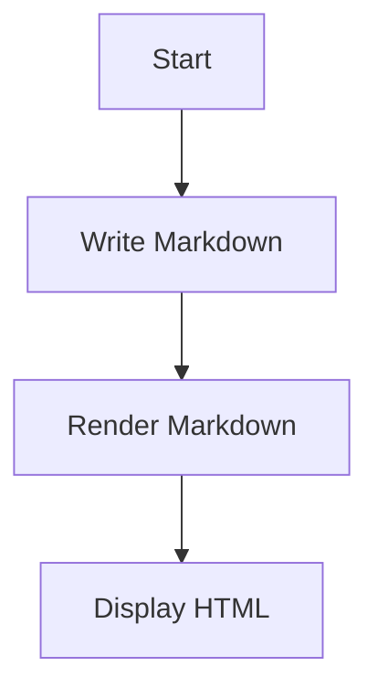
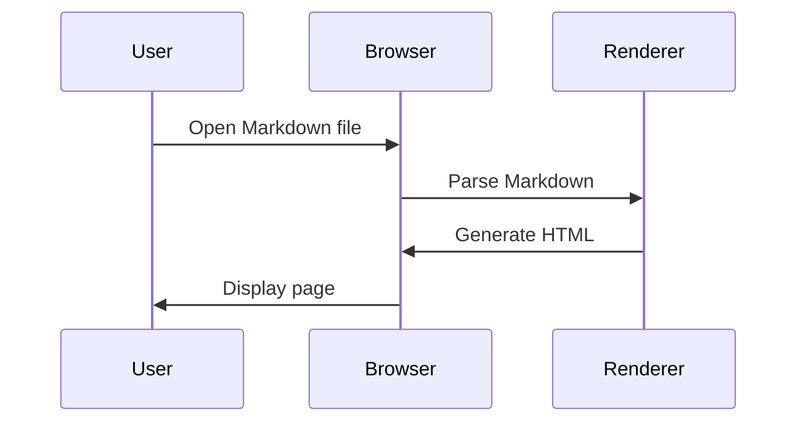

# Markdown Demo Page

Welcome to the **Markdown Demo Page**.

This page demonstrates common Markdown syntax and features.

---

## 1. Headings

Markdown supports six levels of headings:

# Heading 1

## Heading 2

### Heading 3

#### Heading 4

##### Heading 5

###### Heading 6

---

## 2. Paragraphs

This is a normal paragraph.

This is another paragraph.

To create a new paragraph, leave a blank line between blocks of text.

---

## 3. Line Breaks

This is the first line.
This is the second line.

You can also use an HTML `<br>` tag:

First line<br>
Second line

---

## 4. Bold Text

**This text is bold.**

**This text is also bold.**

---

## 5. Italic Text

*This text is italic.*

*This text is also italic.*

---

## 6. Bold and Italic

***This text is bold and italic.***

***This text is also bold and italic.***

**This is bold with *italic* inside it.**

---

## 7. Strikethrough

~~This text has been deleted.~~

---

## 8. Highlighted Text

Standard Markdown does not have a universal highlight syntax.

Some Markdown implementations support:

==This text is highlighted.==

Or HTML can be used:

<mark>This text is highlighted.</mark>

---

## 9. Underline

Markdown does not have standard underline syntax.

You can use HTML:

<u>This text is underlined.</u>

---

## 10. Inline Code

Use `print("Hello World")` to print text in Python.

The command `ls -la` lists files in Linux.

---

## 11. Code Blocks

A fenced code block uses three backticks:

```python
def hello():
    print("Hello World")

hello()
```

JavaScript example:

```javascript
function greet(name) {
    console.log("Hello " + name);
}

greet("Vivek");
```

Bash example:

```bash
echo "Hello World"
ls -la
```

JSON example:

```json
{
    "name": "Vivek",
    "age": 32,
    "skills": [
        "Python",
        "Docker",
        "Kubernetes"
    ]
}
```

---

## 12. Blockquotes

> This is a blockquote.

> This is a longer quotation.
>
> It can contain multiple paragraphs.

Nested blockquote:

> First level
>
> > Second level
>
> > > Third level

---

## 13. Unordered List

* Apple
* Banana
* Orange
* Mango

Another syntax:

* Apple
* Banana
* Orange

Another syntax:

* Apple
* Banana
* Orange

---

## 14. Ordered List

1. First item
2. Second item
3. Third item
4. Fourth item

---

## 15. Nested Lists

* Fruits

  * Apple
  * Banana
  * Orange

* Vegetables

  * Carrot
  * Potato
  * Tomato

---

## 16. Mixed Lists

1. Install Python

   * Download Python
   * Run installer
   * Configure PATH

2. Install packages

   * `pip install requests`
   * `pip install flask`

3. Run the application

---

## 17. Task List

* [x] Learn Markdown
* [x] Create a Markdown file
* [ ] Learn advanced Markdown
* [ ] Create a documentation website

---

## 18. Links

Basic link:

[Visit Google](https://www.google.com)

Link with title:

[Visit Google](https://www.google.com "Google Homepage")

Automatic URL:

https://www.google.com

Email address:

[hello@example.com](mailto:hello@example.com)

---

## 19. Reference Links

This is a [reference link][google].

[google]: https://www.google.com

You can also use:

[Google][1]

[1]: https://www.google.com

---

## 20. Images

Basic image:


Image with title:


---

## 21. Image as a Link

[](https://example.com)

---

## 22. Horizontal Rules

Three hyphens:

---

Three asterisks:

---

Three underscores:

---

---

## 23. Tables

| Name  | Age | Department  |
| ----- | --: | ----------- |
| Vivek |  32 | Engineering |
| Alice |  30 | Design      |
| Bob   |  28 | Marketing   |

---

## 24. Table Alignment

| Left Aligned | Center Aligned | Right Aligned |
| :----------- | :------------: | ------------: |
| Apple        |       Red      |          ₹100 |
| Banana       |     Yellow     |           ₹50 |
| Orange       |     Orange     |           ₹80 |

---

## 25. Escaping Markdown Characters

Use a backslash to display Markdown characters literally.

*This is not italic.*

# This is not a heading.

[This is not a link]

`This is not code`

---

## 26. Special Characters

Ampersand: &

Less than: <

Greater than: >

Copyright: ©

Registered: ®

Trademark: ™

---

## 27. Superscript

Standard Markdown does not universally support superscript.

HTML can be used:

E = mc<sup>2</sup>

---

## 28. Subscript

Water is H<sub>2</sub>O.

Carbon dioxide is CO<sub>2</sub>.

---

## 29. Keyboard Input

HTML can be used for keyboard keys:

Press <kbd>Ctrl</kbd> + <kbd>C</kbd> to copy.

Press <kbd>Ctrl</kbd> + <kbd>V</kbd> to paste.

---

## 30. Definition Lists

Some Markdown implementations support definition lists:

HTML
: HyperText Markup Language

CSS
: Cascading Style Sheets

JavaScript
: A programming language used for web development

---

## 31. Footnotes

Markdown supports footnotes in some implementations.

This statement has a footnote.[^1]

[^1]: This is the footnote text.

Another footnote.[^note]

[^note]: Footnotes can contain additional information.

---

## 32. Abbreviations

Some Markdown implementations support abbreviations:

*[HTML]: HyperText Markup Language

HTML is used to structure web pages.

---

## 33. Details / Collapsible Content

HTML can be embedded in Markdown:

<details>
<summary>Click to expand</summary>

This content is hidden until the section is expanded.

You can put Markdown content here.

</details>

---

## 34. HTML in Markdown

Markdown allows HTML in many implementations.

<div>
    This is an HTML div element.
</div>

<p>This is an HTML paragraph.</p>

---

## 35. Inline HTML

You can mix Markdown and HTML:

This is **bold Markdown** and <strong>bold HTML</strong>.

This is *italic Markdown* and <em>italic HTML</em>.

---

## 36. Comments

HTML comments can be used:

<!-- This comment will not be displayed -->

Markdown itself does not have a dedicated comment syntax.

---

## 37. Automatic Links

https://www.example.com

[hello@example.com](mailto:hello@example.com)

---

## 38. URLs with Special Characters

[Search Google](https://www.google.com/search?q=markdown+demo)

---

## 39. Escaping Backticks

Use double backticks to display code containing backticks:

``Use `inline code` inside this text.``

---

## 40. Code Block with Backticks

You can use four backticks when your code contains three backticks:

````markdown
```python
print("Hello")
```
````

---

## 41. Nested Block Elements

> This is a quote containing a list:
>
> * Item 1
> * Item 2
> * Item 3
>
> And some **bold text**.

---

## 42. Nested Formatting

***Bold and italic***

**Bold with *italic* inside**

*Italic with **bold** inside*

---

## 43. Long Text

Lorem ipsum dolor sit amet, consectetur adipiscing elit.

Sed do eiusmod tempor incididunt ut labore et dolore magna aliqua.

Ut enim ad minim veniam, quis nostrud exercitation ullamco laboris nisi ut aliquip ex ea commodo consequat.

---

## 44. Mathematical Expressions

Some Markdown implementations support LaTeX math.

Inline equation:

$E = mc^2$

Block equation:

$$
E = mc^2
$$

Another example:

$$
\frac{a}{b} = c
$$

---

## 45. Emoji

Markdown implementations may support emoji:

😀 😃 😄 😎 🚀 ❤️ 👍 🎉

GitHub-style emoji:

:smile:

:rocket:

:+1:

---

## 46. Checkboxes

* [x] Completed task
* [ ] Pending task
* [ ] Another task

---

## 47. Mention

Some platforms support mentions:

@username

---

## 48. Hashtags

Some platforms automatically recognize hashtags:

#Markdown

#HTML

#Documentation

---

## 49. Alerts / Admonitions

Some Markdown implementations support special callouts.

> [!NOTE]
> This is an informational note.

> [!TIP]
> This is a useful tip.

> [!WARNING]
> This is a warning.

> [!CAUTION]
> Be careful with this operation.

> [!IMPORTANT]
> This information is important.

---

## 50. Mermaid Diagram

Some Markdown platforms support Mermaid diagrams.



---

## 51. Mermaid Sequence Diagram



---

## 52. HTML Table

Markdown can contain raw HTML:

<table>
    <tr>
        <th>Name</th>
        <th>Age</th>
    </tr>
    <tr>
        <td>Vivek</td>
        <td>32</td>
    </tr>
</table>

---

## 53. HTML Image


---

## 54. HTML Link

<a href="https://example.com">
    Visit Example
</a>

---

## 55. Line Break Using HTML

First line.<br>
Second line.

---

## 56. Horizontal Rule Using HTML

<hr>

---

## 57. Quote with Citation

> The important thing is to never stop learning.

— Anonymous

---

## 58. File Paths

Use inline code for file paths:

`/etc/nginx/nginx.conf`

`C:\Users\Vivek\Documents`

---

## 59. Commands

Run:

```bash
sudo apt update
sudo apt install nginx
sudo systemctl enable nginx
sudo systemctl start nginx
```

---

## 60. Shell Output

```text
$ python app.py
Server started on http://localhost:8000
```

---

## 61. Diff

```diff
- print("Old code")
+ print("New code")
```

---

## 62. YAML

```yaml
name: Example
version: 1.0
enabled: true

items:
  - one
  - two
  - three
```

---

## 63. XML

```xml
<user>
    <name>Vivek</name>
    <age>32</age>
</user>
```

---

## 64. SQL

```sql
SELECT *
FROM users
WHERE age > 30;
```

---

## 65. Python

```python
users = ["Vivek", "Alice", "Bob"]

for user in users:
    print(user)
```

---

## 66. JavaScript

```javascript
const message = "Hello World";

console.log(message);
```

---

## 67. JSON

```json
{
    "name": "Vivek",
    "role": "Engineer",
    "skills": [
        "Python",
        "Docker",
        "AWS"
    ]
}
```

---

## 68. Nested Code

A Markdown document can contain code examples:

```markdown
# My Document

This is **bold**.

- Item 1
- Item 2
```

---

## 69. Escape All Common Markdown Characters

# Heading

* Asterisk

_ Underscore

+ Plus

- Hyphen

. Period

! Exclamation

[ Bracket

] Bracket

( Parenthesis

) Parenthesis

> Greater-than

# This remains normal text.

---

## 70. Complete Example

# My Project

**My Project** is a simple application built using **Python**.

## Features

* Fast
* Easy to use
* Open source

## Installation

Run:

```bash
git clone https://github.com/example/project.git
cd project
pip install -r requirements.txt
```

## Usage

```python
from project import hello

hello("Vivek")
```

## Configuration

| Setting | Value       |
| ------- | ----------- |
| Host    | `localhost` |
| Port    | `8000`      |
| Debug   | `true`      |

## Status

* [x] Development
* [x] Testing
* [ ] Production

> **Note:** This project is currently under development.

## License

This project is licensed under the MIT License.

---

## Markdown Cheat Sheet

| Syntax         | Result            |
| -------------- | ----------------- |
| `# Heading`    | Heading           |
| `**bold**`     | **Bold**          |
| `*italic*`     | *Italic*          |
| `~~text~~`     | ~~Strikethrough~~ |
| `` `code` ``   | `Code`            |
| `[Link](url)`  | Link              |
| ``  | Image             |
| `> Quote`      | Blockquote        |
| `- Item`       | Unordered list    |
| `1. Item`      | Ordered list      |
| `- [ ] Task`   | Unchecked task    |
| `- [x] Task`   | Checked task      |
| `---`          | Horizontal rule   |
| `\| A \| B \|` | Table             |
| `[^1]`         | Footnote          |
| `$x^2$`        | Math              |
| ` ``` `        | Code block        |

---

# End of Markdown Demo

This document demonstrates the most commonly supported Markdown syntax.

Markdown implementations differ. Features such as **footnotes, task lists, tables, math, Mermaid diagrams, alerts, definition lists, and raw HTML** depend on the Markdown renderer being used.
